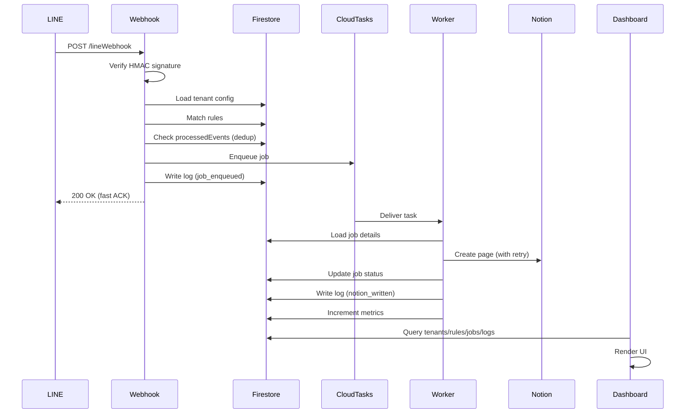

# Architecture Final — LINE-Notion Multi-Tenant Platform

**Version**: 2.0 (Phase 5 Complete)  
**Updated**: 2026-01-15

---

## 1. System Overview

```
┌─────────────────────────────────────────────────────────────────────┐
│                         LINE Platform                                │
└────────────────────────────────┬────────────────────────────────────┘
                                 │ Webhook
                                 ▼
┌─────────────────────────────────────────────────────────────────────┐
│                    Cloud Functions (Gen 2)                          │
│  ┌───────────────────────────────────────────────────────────────┐ │
│  │  webhook.handler                                               │ │
│  │  - Verify X-Line-Signature (rawBody + HMAC)                   │ │
│  │  - Load tenant config from Firestore                           │ │
│  │  - Match rules                                                 │ │
│  │  - Enqueue job → Cloud Tasks                                   │ │
│  │  - Quick ACK (< 3s)                                            │ │
│  └───────────────────────────────────────────────────────────────┘ │
│  ┌───────────────────────────────────────────────────────────────┐ │
│  │  worker.handler                                                │ │
│  │  - Consume jobs from queue                                     │ │
│  │  - Write to Notion (with retry/backoff)                        │ │
│  │  - Update job status                                           │ │
│  │  - Write logs/metrics                                          │ │
│  └───────────────────────────────────────────────────────────────┘ │
└─────────────────────────────────────────────────────────────────────┘
                                 │
            ┌────────────────────┼────────────────────┐
            ▼                    ▼                    ▼
┌───────────────────┐ ┌────────────────────┐ ┌─────────────────────┐
│     Firestore     │ │   Cloud Tasks      │ │   Secret Manager    │
│  - tenants        │ │   - Job Queue      │ │   - LINE Secrets    │
│  - rules          │ │   - DLQ            │ │   - Notion Tokens   │
│  - jobs           │ │   - Retry Policy   │ └─────────────────────┘
│  - logs           │ └────────────────────┘
│  - metrics        │
│  - admins         │             ┌─────────────────────────┐
└───────────────────┘             │      Notion API         │
                                  │  - Create Pages         │
                                  │  - Rate: 3 req/sec      │
                                  └─────────────────────────┘

┌─────────────────────────────────────────────────────────────────────┐
│                    Dashboard (Next.js + Vercel)                      │
│  ┌──────────┐ ┌──────────┐ ┌──────────┐ ┌──────────┐ ┌───────────┐ │
│  │ Tenants  │ │  Rules   │ │ Mappings │ │   Jobs   │ │   Logs    │ │
│  │  CRUD    │ │ CRUD+Test│ │  CRUD    │ │ Requeue  │ │  Query    │ │
│  └──────────┘ └──────────┘ └──────────┘ └──────────┘ └───────────┘ │
│                    Firebase Auth (RBAC: owner/admin/viewer)          │
└─────────────────────────────────────────────────────────────────────┘
```

---

## 2. Data Flow



---

## 3. RBAC Model (Dashboard)

| Role | Tenants | Rules | Mappings | Jobs | Logs | Metrics |
|------|---------|-------|----------|------|------|---------|
| owner | CRUD | CRUD | CRUD | Requeue/Ignore | Read | Read |
| admin | CRUD | CRUD | CRUD | Requeue/Ignore | Read | Read |
| viewer | Read | Read | Read | Read | Read | Read |

### Firestore Collection: `/admins/{uid}`

```json
{
  "enabled": true,
  "role": "admin",
  "allowTenants": [],  // Empty = all
  "createdAt": "timestamp",
  "updatedAt": "timestamp"
}
```

---

## 4. Collections Structure

| Collection | Purpose |
|------------|---------|
| `/admins/{uid}` | Dashboard RBAC |
| `/tenants/{tenantId}` | Tenant config |
| `/tenants/{tenantId}/rules/{ruleId}` | Routing rules |
| `/tenants/{tenantId}/mappings/{mappingId}` | Field mappings |
| `/jobs/{jobId}` | Queue tasks |
| `/logs/{logId}` | Audit logs |
| `/metrics_daily/{tenantId_yyyyMMdd}` | Daily counters |
| `/processedEvents/{eventKey}` | Deduplication |

---

## 5. API Routes (Dashboard)

| Method | Endpoint | Role |
|--------|----------|------|
| GET | `/api/admin/me` | * |
| GET | `/api/admin/stats` | * |
| GET/POST | `/api/admin/tenants` | admin+ |
| GET/PUT/DELETE | `/api/admin/tenants/:id` | admin+ |
| GET/POST | `/api/admin/rules?tenantId=` | admin+ |
| GET/PUT/DELETE | `/api/admin/rules/:id?tenantId=` | admin+ |
| POST | `/api/admin/rules/test` | * |
| GET/POST | `/api/admin/mappings?tenantId=` | admin+ |
| GET | `/api/admin/jobs` | * |
| POST | `/api/admin/jobs/:id/requeue` | admin+ |
| POST | `/api/admin/jobs/:id/ignore` | admin+ |
| GET | `/api/admin/logs` | * |
| GET | `/api/admin/metrics` | * |

---

## 6. Security Measures

1. **Webhook Verification**: HMAC-SHA256 with timingSafeEqual
2. **Secrets**: All tokens in Secret Manager
3. **Firestore Rules**: Client can't write sensitive collections
4. **Dashboard API**: Bearer token verification + RBAC
5. **Deduplication**: processedEvents prevents replay attacks

---

## 7. Deployment

| Component | Target | Command |
|-----------|--------|---------|
| Functions | Firebase | `firebase deploy --only functions` |
| Rules | Firebase | `firebase deploy --only firestore:rules` |
| Dashboard | Vercel | `cd dashboard && vercel --prod` |
