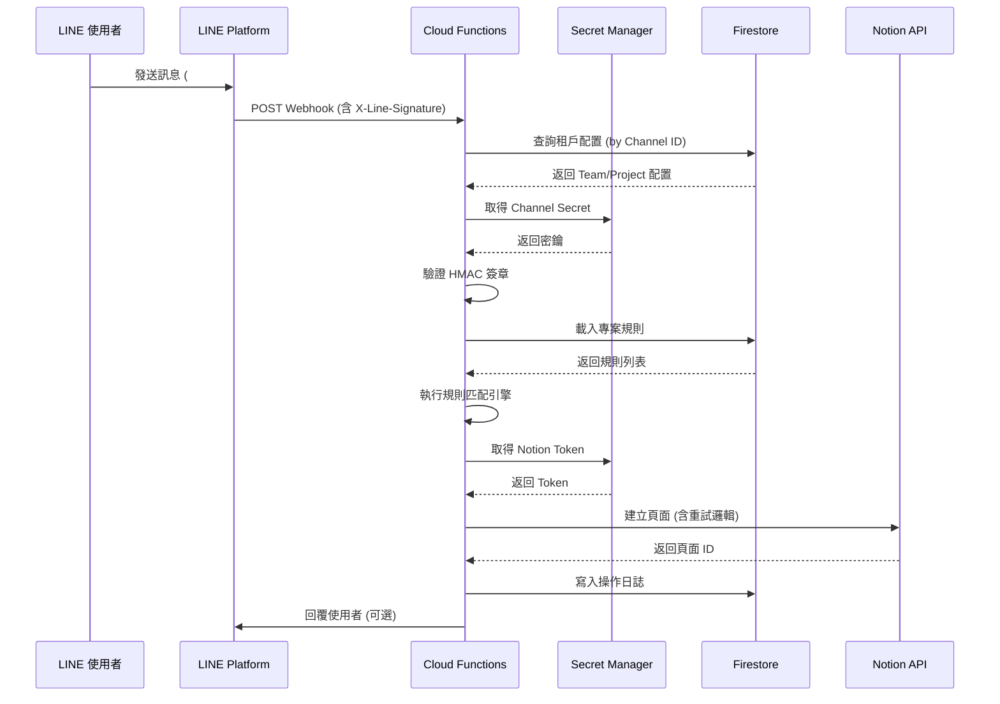

# Senteng LINE-to-Notion 自動化平台

## 系統架構與技術文件

> **版本**: v1.0.0  
> **最後更新**: 2026-01-15  
> **專案類型**: Multi-tenant Serverless Platform

---

## 目錄

1. [系統概述](#系統概述)
2. [架構設計](#架構設計)
3. [技術堆疊](#技術堆疊)
4. [核心模組](#核心模組)
5. [資料模型](#資料模型)
6. [安全機制](#安全機制)
7. [API 規格](#api-規格)
8. [部署與營運](#部署與營運)

---

## 系統概述

### 專案目標

本平台是一個**多租戶無伺服器解決方案**，建構於 Google Cloud Platform / Firebase 之上。作為 **LINE Messaging API** 與 **Notion API** 之間的橋樑，允許使用者透過 LINE 訊息依據可配置的規則將資訊儲存至 Notion。

### 核心價值

| 功能特色 | 說明 |
|:---------|:-----|
| **動態路由** | 訊息根據內容模式 (`#todo`、`#idea` 等) 路由至不同的 Notion 資料庫 |
| **企業級安全** | 對每個 LINE Webhook 事件進行完整 HMAC 簽章驗證 |
| **高可靠性** | 對 Notion API 速率限制自動重試 (指數退避) |
| **可擴展性** | 設計支援未來擴展圖片 (OCR) 和位置資料處理 |

### 架構演進

| 特性 | 舊架構 (GAS/Sheets) | 新架構 (Firestore/Functions v2) |
|:-----|:---------------------|:-------------------------------|
| **邏輯層** | Google Apps Script `doPost` | Firebase Cloud Functions (Gen 2) |
| **持久化** | Google Sheets | Cloud Firestore |
| **密鑰管理** | 腳本屬性/硬編碼 | GCP Secret Manager |
| **租戶模式** | 每頻道一腳本 | Firestore 多租戶查詢 |
| **安全性** | 不一致的簽章驗證 | 標準化 HMAC 驗證 |
| **可靠性** | 無重試機制 | 指數退避 + 速率限制處理 |

---

## 架構設計

### 系統架構圖

```
┌─────────────────────────────────────────────────────────────────────────────┐
│                           LINE Platform                                      │
│  ┌─────────────┐                                                            │
│  │ LINE User   │ ──message──▶ LINE Official Account                         │
│  └─────────────┘                      │                                     │
└───────────────────────────────────────│─────────────────────────────────────┘
                                        │ Webhook POST
                                        ▼
┌─────────────────────────────────────────────────────────────────────────────┐
│                        Google Cloud Platform                                 │
│                                                                              │
│  ┌─────────────────────────────────────────────────────────────────────┐   │
│  │                    Firebase Cloud Functions                          │   │
│  │  ┌──────────────┐  ┌──────────────┐  ┌──────────────┐               │   │
│  │  │   Webhook    │  │    Rules     │  │   Notion     │               │   │
│  │  │   Handler    │──│   Engine     │──│   Client     │               │   │
│  │  │ (Gen2/v2)    │  │              │  │              │               │   │
│  │  └──────────────┘  └──────────────┘  └──────────────┘               │   │
│  └─────────────────────────────────────────────────────────────────────┘   │
│           │                    │                    │                        │
│           ▼                    ▼                    ▼                        │
│  ┌─────────────┐      ┌─────────────┐      ┌─────────────┐                 │
│  │   Secret    │      │  Firestore  │      │    Cloud    │                 │
│  │   Manager   │      │  (Config)   │      │   Logging   │                 │
│  └─────────────┘      └─────────────┘      └─────────────┘                 │
│                                                                              │
└─────────────────────────────────────────────────────────────────────────────┘
                                        │
                                        │ Notion API
                                        ▼
┌─────────────────────────────────────────────────────────────────────────────┐
│                           Notion Workspace                                   │
│  ┌─────────────┐  ┌─────────────┐  ┌─────────────┐                         │
│  │  Database A │  │  Database B │  │  Database C │  ...                    │
│  │  (Team 1)   │  │  (Team 1)   │  │  (Team 2)   │                         │
│  └─────────────┘  └─────────────┘  └─────────────┘                         │
└─────────────────────────────────────────────────────────────────────────────┘
```

### 資料流程



---

## 技術堆疊

### 核心技術

| 類別 | 技術 | 版本 |
|:-----|:-----|:-----|
| **Runtime** | Node.js | 18 |
| **Language** | TypeScript | 5.7.2 |
| **Functions** | Firebase Cloud Functions | v2 (Gen 2) / 6.1.2 |
| **Database** | Cloud Firestore | - |
| **Secrets** | Google Cloud Secret Manager | 5.6.0 |
| **Notion SDK** | @notionhq/client | 2.2.15 |
| **Admin SDK** | firebase-admin | 12.7.0 |

### 開發工具

| 類別 | 工具 | 版本 |
|:-----|:-----|:-----|
| **Linter** | ESLint | 8.57.1 |
| **Testing** | Jest | 29.7.0 |
| **TypeScript** | ts-jest | 29.2.5 |

### 函式配置

```typescript
// 全域設定
setGlobalOptions({
    region: 'asia-east1',     // 台灣區域
    memory: '256MiB',         // 記憶體配置
    timeoutSeconds: 60,       // 超時時間
    maxInstances: 10,         // 最大實例數
});
```

---

## 核心模組

### 模組架構

```
functions/src/
├── index.ts                 # 入口點，匯出 Cloud Function
├── config/
│   ├── firebase.ts          # Firebase Admin 初始化
│   └── index.ts             # 配置匯出
├── handlers/
│   └── webhook.handler.ts   # Webhook 主處理器
├── services/
│   ├── line.service.ts      # LINE API 整合
│   ├── notion.service.ts    # Notion API 整合
│   ├── rules.service.ts     # 規則引擎
│   ├── secrets.service.ts   # 密鑰管理
│   └── tenant.service.ts    # 多租戶管理
├── models/
│   └── index.ts             # TypeScript 資料模型
├── types/
│   └── *.ts                 # 類型定義
└── utils/
    ├── logger.ts            # 日誌工具
    ├── retry.ts             # 重試邏輯
    └── validation.ts        # 驗證工具
```

### 1. Webhook Handler (`webhook.handler.ts`)

主要進入點，負責處理 LINE Webhook 請求的多步驟驗證與處理流程：

```typescript
// 處理流程
1. Method 檢查 (僅接受 POST)
2. 簽章存在性檢查 (X-Line-Signature)
3. Payload 結構驗證
4. 租戶配置查詢 (by Channel ID)
5. HMAC 簽章加密驗證
6. 事件批次處理 (Promise.allSettled)
7. 操作日誌記錄
8. 回覆使用者 (可選)
```

**核心函式**:

- `handleWebhook()` - 主入口
- `processEvent()` - 單一事件處理
- `processTextMessage()` - 文字訊息處理

### 2. Rules Engine (`rules.service.ts`)

規則匹配引擎，支援多種匹配模式：

| 匹配類型 | 說明 | 範例 |
|:---------|:-----|:-----|
| `prefix` | 前綴匹配 | `#todo` 匹配 `#todo 買牛奶` |
| `keyword` | 關鍵字匹配 | `urgent` 匹配 `this is urgent task` |
| `contains` | 包含匹配 | 同 keyword |
| `regex` | 正則表達式 | `^\\d{4}-\\d{2}` 匹配日期格式 |

**核心功能**:

```typescript
interface MatchResult {
    ruleId: string;           // 匹配的規則 ID
    ruleName: string;         // 規則名稱
    databaseId: string;       // 目標 Notion 資料庫
    properties: NotionProperties;  // 轉換後的屬性
    originalText: string;     // 原始訊息
    processedText: string;    // 處理後的文字
}
```

**屬性映射**:

- `title` → Notion Title 欄位
- `date` → 自動填入當日日期 (ISO 格式)
- `status` → 狀態欄位
- `tags` → Multi-select 標籤
- `customFields` → 自訂欄位 (支援 string/number/boolean)

### 3. Notion Client (`notion.service.ts`)

與 Notion API 的整合層，內建重試機制：

**功能列表**:

| 函式 | 說明 |
|:-----|:-----|
| `writeToNotion()` | 建立新頁面 |
| `getDatabaseSchema()` | 取得資料庫結構 |
| `updateNotionPage()` | 更新現有頁面 |

**重試策略**:

```typescript
retry(operation, {
    maxRetries: 3,           // 最大重試次數
    baseDelayMs: 1000,       // 基礎延遲 (ms)
    shouldRetry: isRetryableError,  // 僅重試 429/5xx
});
```

**快取機制**:

- Client 快取 TTL: 10 分鐘
- 減少 Secret Manager 呼叫次數

### 4. Tenant Service (`tenant.service.ts`)

多租戶管理，負責根據 LINE Channel ID 解析完整租戶配置：

**快取機制**:

- 租戶配置快取 TTL: 5 分鐘
- 快取鍵格式: `channel:{channelId}`

**解析流程**:

```
1. 查詢 integrations (by line.channelId)
2. 取得關聯的 team 文檔
3. 取得該 team 的活躍 project
4. 組合成 TenantConfig 返回
```

### 5. Secrets Service (`secrets.service.ts`)

安全管理敏感憑證：

- `getLineChannelSecret()` - 取得 LINE Channel Secret
- `getNotionToken()` - 取得 Notion Integration Token
- 內建 5 分鐘快取以減少 API 呼叫

### 6. LINE Service (`line.service.ts`)

LINE API 整合：

- `verifySignature()` - HMAC 簽章驗證 (使用 `crypto.timingSafeEqual`)
- `replyMessage()` - 發送回覆訊息

---

## 資料模型

### Firestore 集合結構

```
firestore/
├── teams/                          # 團隊組織
│   └── {teamId}/
│       ├── projects/               # 專案/頻道
│       │   └── {projectId}/
│       │       ├── rules/          # 訊息路由規則
│       │       └── databases/      # Notion DB 結構快取
│       └── members/                # 團隊成員與 RBAC
├── integrations/                   # 第三方服務連結
├── logs/                           # 全域操作日誌
└── processedEvents/                # 事件 ID 追蹤 (去重)
```

### 核心資料表

#### Team (`teams/{teamId}`)

```typescript
interface Team {
    id: string;
    name: string;              // 團隊名稱
    slug: string;              // 唯一識別碼
    ownerId: string;           // 擁有者 ID
    plan: 'free' | 'pro' | 'enterprise';
    settings: {
        replyEnabled: boolean;         // 啟用 LINE 回覆
        defaultTimezone: string;       // 預設時區
        replyMessages?: {
            success?: string;          // 成功訊息
            failure?: string;          // 失敗訊息
            noMatch?: string;          // 無匹配訊息
        };
    };
    createdAt: Timestamp;
    updatedAt: Timestamp;
}
```

#### Rule (`teams/{teamId}/projects/{projectId}/rules/{ruleId}`)

```typescript
interface Rule {
    id: string;
    projectId: string;
    name: string;
    priority: number;          // 優先順序 (數字越小越優先)
    isActive: boolean;
    matcher: {
        type: 'keyword' | 'prefix' | 'regex' | 'contains';
        pattern: string;
        caseSensitive: boolean;
    };
    action: {
        databaseId: string;    // 目標 Notion Database ID
        fieldMapping: {
            title: string;
            date?: string;
            status?: string;
            tags?: string[];
            customFields?: Record<string, string | number | boolean>;
        };
        removePattern: boolean;  // 是否移除匹配的模式
    };
    createdAt: Timestamp;
    updatedAt: Timestamp;
}
```

#### Integration (`integrations/{integrationId}`)

```typescript
interface Integration {
    id: string;
    teamId: string;
    type: 'line' | 'notion';
    name: string;
    line?: {
        channelId: string;
        // Secret 儲存於 Secret Manager
    };
    notion?: {
        workspaceId: string;
        workspaceName: string;
        // Token 儲存於 Secret Manager
    };
    isActive: boolean;
    createdAt: Timestamp;
    updatedAt: Timestamp;
}
```

#### Operation Log (`logs/{logId}`)

```typescript
interface OperationLog {
    id: string;
    teamId: string;
    projectId?: string;
    type: 'message_received' | 'notion_write' | 'error' | 'config_change';
    message?: {
        lineUserId: string;
        messageType: 'text' | 'image' | 'location' | 'sticker';
        contentPreview: string;
        matchedRuleId?: string;
    };
    notion?: {
        databaseId: string;
        pageId?: string;
        status: 'success' | 'failed' | 'retrying';
        errorCode?: string;
        errorMessage?: string;
    };
    timestamp: Timestamp;
    duration?: number;
}
```

### Firestore 索引

| 集合 | 索引欄位 | 用途 |
|:-----|:---------|:-----|
| `rules` | `projectId` + `isActive` + `priority` | 規則查詢 |
| `logs` | `teamId` + `timestamp` | 團隊日誌查詢 |
| `logs` | `teamId` + `type` + `timestamp` | 類型過濾查詢 |
| `logs` | `projectId` + `timestamp` | 專案日誌查詢 |
| `members` | `userId` (Collection Group) | 使用者成員資格查詢 |
| `integrations` | `type` + `line.channelId` | Webhook 路由查詢 |

---

## 安全機制

### 1. Webhook 簽章驗證

```typescript
// 使用 crypto.timingSafeEqual 防止時序攻擊
const expected = crypto
    .createHmac('SHA256', channelSecret)
    .update(rawBody)
    .digest('base64');

return crypto.timingSafeEqual(
    Buffer.from(signature),
    Buffer.from(expected)
);
```

### 2. 密鑰管理

- 所有敏感憑證儲存於 **GCP Secret Manager**
- 密鑰命名格式: `line-channel-secret-{integrationId}`, `notion-token-{integrationId}`
- 內建快取減少 API 呼叫

### 3. 輸入驗證

- Payload 結構驗證
- 文字內容清理 (移除控制字元)
- 長度限制處理

### 4. 存取控制

```javascript
// Firestore 安全規則範例
rules_version = '2';
service cloud.firestore {
  match /databases/{database}/documents {
    // 團隊存取控制
    match /teams/{teamId} {
      allow read, write: if isTeamMember(teamId);
    }
  }
}
```

---

## API 規格

### LINE Webhook Endpoint

```
POST https://asia-east1-{project-id}.cloudfunctions.net/lineWebhook
```

**Headers**:

| Header | 說明 |
|:-------|:-----|
| `Content-Type` | `application/json` |
| `X-Line-Signature` | HMAC-SHA256 簽章 (Base64) |

**Request Body**:

```json
{
    "destination": "U1234567890abcdef",
    "events": [
        {
            "type": "message",
            "replyToken": "nHuyWiB7yP5Zw52FIkcQobQuGDXCTA",
            "source": {
                "type": "user",
                "userId": "U1234567890abcdef"
            },
            "message": {
                "type": "text",
                "id": "1234567890",
                "text": "#todo 買牛奶"
            }
        }
    ]
}
```

**Response**:

| 狀態碼 | 說明 |
|:-------|:-----|
| `200` | 處理成功 |
| `400` | 無效的請求格式 |
| `401` | 缺少或無效的簽章 |
| `405` | 不支援的 HTTP 方法 |
| `500` | 內部伺服器錯誤 |

---

## 部署與營運

### 開發指令

```bash
# 建置
npm run build

# 本地模擬器
npm run serve

# Lint 檢查
npm run lint

# 單元測試
npm run test

# 部署至 Firebase
npm run deploy
```

### 環境變數

```bash
# .env.example
GOOGLE_CLOUD_PROJECT=your-project-id
```

### 專案結構

```
SENTENG-LINEBOT-NOTION/
├── .github/                    # GitHub Actions
├── functions/                  # Cloud Functions 原始碼
│   ├── src/                   # TypeScript 原始碼
│   ├── lib/                   # 編譯輸出
│   ├── package.json
│   └── tsconfig.json
├── scripts/                    # 維運腳本
├── docs/                       # 文件
├── firebase.json              # Firebase 配置
├── firestore.rules            # Firestore 安全規則
├── firestore.indexes.json     # Firestore 索引
└── README.md
```

### 監控與日誌

- **Cloud Logging**: 系統層級日誌
- **Firestore Logs**: 操作審計追蹤
- **Error Reporting**: 異常追蹤

### 效能最佳化

1. **快取策略**:
   - 租戶配置: 5 分鐘
   - Notion Client: 10 分鐘
   - Secret: 5 分鐘

2. **並行處理**:
   - 使用 `Promise.allSettled` 處理批次事件

3. **冷啟動優化**:
   - 最小化依賴載入
   - 使用 Gen 2 Functions

---

## 擴展規劃

### 已規劃功能

- [ ] 圖片訊息處理 (OCR 整合)
- [ ] 位置訊息處理
- [ ] 管理儀表板
- [ ] Webhook 重試機制 (Dead Letter Queue)
- [ ] 多語系支援

### API 擴展

- [ ] REST API 管理介面
- [ ] WebSocket 即時通知
- [ ] Batch 處理端點

---

## 附錄

### 相關連結

- [LINE Messaging API](https://developers.line.biz/en/docs/messaging-api/)
- [Notion API](https://developers.notion.com/)
- [Firebase Cloud Functions](https://firebase.google.com/docs/functions)
- [GCP Secret Manager](https://cloud.google.com/secret-manager)

### 變更記錄

| 日期 | 版本 | 變更內容 |
|:-----|:-----|:---------|
| 2026-01-15 | v1.0.0 | 初始版本 |
