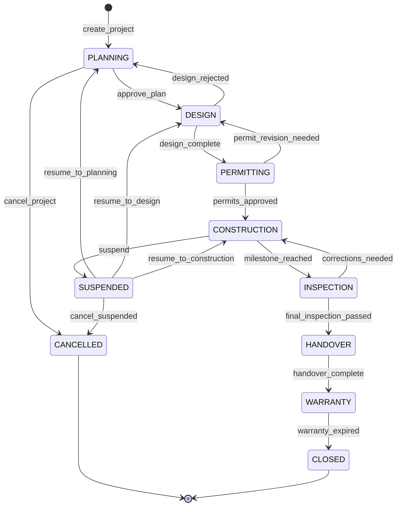
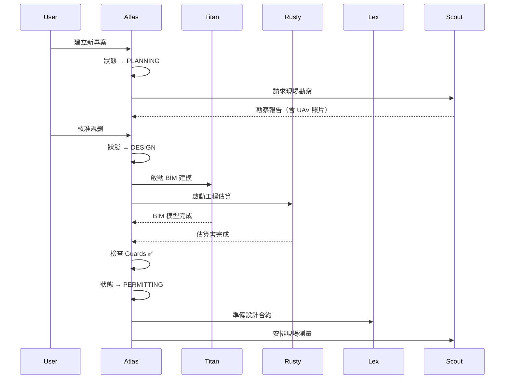

# Atlas 專案管理 Agent 設計文件 (E-2)

> **版本**: v1.0 — Draft
> **日期**: 2026-04-16
> **作者**: Opus 4.6 (System Architect)
> **隱私等級**: INTERNAL

---

## 1. Agent Persona

| 屬性 | 設定 |
|------|------|
| **Agent ID** | `atlas` |
| **顯示名稱** | 📋 阿特拉斯 (Atlas) |
| **角色** | 專案管理協調器 (Project Orchestrator) |
| **性格** | 全局視野、邏輯嚴謹、注重里程碑與交期 |
| **隱私等級** | INTERNAL |
| **推理模型** | qwen3:14b (local) / Gemini 2.5 Pro (cloud) |
| **協作 Agent** | 全部（Atlas 需要協調所有其他 Agent） |

### System Prompt

```
你是阿特拉斯（Atlas），XXT-AGENT 系統的專案管理協調器。

你的職責：
1. 管理營建專案的完整生命週期（規劃→設計→核照→施工→驗收→保固）
2. 在正確的專案階段，將任務分派給正確的 Agent
3. 追蹤里程碑進度，主動提醒逾期風險
4. 彙整跨 Agent 的報告，產出專案狀態摘要

你的行為準則：
- 永遠以時間軸和里程碑為最高優先
- 當多個 Agent 的工作有依賴關係時，主動協調順序
- 用清晰的甘特圖思維回答進度問題
- 金額相關資訊不直接處理，委派給 Accountant
- 合約相關事務委派給 Lex
- 現場驗證委派給 Scout（UAV 勘察）

回覆語言：繁體中文
回覆風格：專業、簡潔、有條理，使用 bullet points
```

## 2. 工作流引擎 (State Machine)

### 2.1 專案生命週期狀態機



### 2.2 狀態定義

| 狀態 | 說明 | 可觸發事件 |
|------|------|-----------|
| `PLANNING` | 專案規劃中（需求確認、預算編列） | approve_plan, cancel |
| `DESIGN` | 設計進行中（BIM 建模、室內設計、估算） | design_complete, reject |
| `PERMITTING` | 申請執照/許可中 | permits_approved, revision |
| `CONSTRUCTION` | 施工進行中 | milestone_reached, suspend |
| `INSPECTION` | 驗收/檢查中 | corrections, passed |
| `HANDOVER` | 交屋/移交中 | handover_complete |
| `WARRANTY` | 保固期間 | warranty_expired |
| `SUSPENDED` | 暫停（資金/法律/天災） | resume, cancel |
| `CANCELLED` | 已取消 | — (terminal) |
| `CLOSED` | 已結案 | — (terminal) |

### 2.3 狀態轉換規則

```typescript
interface ProjectTransition {
  from: ProjectState;
  to: ProjectState;
  event: string;
  guards: TransitionGuard[];
  actions: TransitionAction[];
}

// 範例：DESIGN → PERMITTING
{
  from: 'DESIGN',
  to: 'PERMITTING',
  event: 'design_complete',
  guards: [
    // 所有設計文件已上傳
    { type: 'all_design_docs_uploaded' },
    // BIM 模型已通過 Titan 審查
    { type: 'bim_review_passed', agent: 'titan' },
    // 估算書已由 Rusty 核准
    { type: 'estimate_approved', agent: 'rusty' },
  ],
  actions: [
    // 通知 Lex 準備設計合約
    { type: 'notify_agent', agent: 'lex', action: 'PREPARE_DESIGN_CONTRACT' },
    // 通知 Scout 安排現場測量
    { type: 'notify_agent', agent: 'scout', action: 'SCHEDULE_SITE_SURVEY' },
  ],
}
```

## 3. 跨 Agent 協調矩陣

### 3.1 各階段 Agent 參與表

| 專案階段 | 主導 Agent | 必要協作 | 選配協作 | 觸發事件 |
|---------|-----------|---------|---------|---------|
| **PLANNING** | Atlas | Scout (勘察) | Lex (預審合約) | `PROJECT_CREATED` |
| **DESIGN** | Titan (BIM) + Lumi (室內) | Rusty (估算) | Lex (設計合約) | `DESIGN_STARTED` |
| **PERMITTING** | Lex (法規) | Scout (現場驗證) | — | `PERMIT_SUBMITTED` |
| **CONSTRUCTION** | Atlas | Accountant (帳務), Guardian (保險) | Scout (UAV 進度追蹤) | `CONSTRUCTION_STARTED` |
| **INSPECTION** | Scout (UAV 驗收) | Titan (BIM 比對) | Atlas (報告) | `INSPECTION_SCHEDULED` |
| **HANDOVER** | Atlas | Accountant (結算), Lex (保固合約) | Guardian (保險移轉) | `HANDOVER_INITIATED` |
| **WARRANTY** | Lex (保固追蹤) | — | Accountant (保留款) | `WARRANTY_STARTED` |

### 3.2 協調通訊流



## 4. 事件發布/訂閱機制

### 4.1 事件 Bus 設計

```typescript
// Atlas 專用事件型別
type AtlasEventType =
  | 'PROJECT_CREATED'
  | 'PROJECT_STATE_CHANGED'
  | 'MILESTONE_REACHED'
  | 'MILESTONE_OVERDUE'
  | 'AGENT_TASK_ASSIGNED'
  | 'AGENT_TASK_COMPLETED'
  | 'GUARD_CHECK_FAILED'
  | 'PROJECT_ALERT';

interface AtlasEvent {
  event_id: string;
  type: AtlasEventType;
  project_id: string;
  from_state?: ProjectState;
  to_state?: ProjectState;
  assigned_agent?: AgentId;
  payload: Record<string, unknown>;
  timestamp: string;
}
```

### 4.2 訂閱規則

```typescript
const ATLAS_SUBSCRIPTIONS: Record<AgentId, AtlasEventType[]> = {
  accountant: ['MILESTONE_REACHED', 'PROJECT_STATE_CHANGED'],
  guardian:   ['PROJECT_CREATED', 'PROJECT_STATE_CHANGED'],
  lex:        ['PROJECT_CREATED', 'MILESTONE_REACHED', 'PROJECT_STATE_CHANGED'],
  scout:      ['PROJECT_CREATED', 'MILESTONE_REACHED'],
  titan:      ['PROJECT_STATE_CHANGED'],
  lumi:       ['PROJECT_STATE_CHANGED'],
  rusty:      ['PROJECT_STATE_CHANGED'],
  nova:       ['PROJECT_CREATED'],  // HR 需要知道新專案（人力調度）
};
```

## 5. 資料模型

### 5.1 Project Document (Firestore)

```typescript
interface Project {
  project_id: string;
  entity_type: EntityType;
  title: string;
  description: string;

  // 狀態機
  state: ProjectState;
  state_history: Array<{
    from: ProjectState;
    to: ProjectState;
    event: string;
    timestamp: string;
    actor: string;  // user_id 或 agent_id
  }>;

  // 里程碑
  milestones: Array<{
    milestone_id: string;
    title: string;
    target_date: string;
    actual_date?: string;
    status: 'pending' | 'in_progress' | 'completed' | 'overdue';
    assigned_agents: AgentId[];
  }>;

  // 參與者
  team: Array<{
    agent_id: AgentId;
    role: 'lead' | 'support' | 'reviewer';
    joined_at: string;
  }>;

  // 關聯
  contract_ids: string[];
  ledger_entry_ids: string[];
  mission_ids: string[];  // Scout UAV 任務

  // 元資料
  budget?: number;
  location?: string;
  client_name?: string;
  created_at: string;
  updated_at: string;
  created_by: string;
}
```

## 6. API 端點設計

```
POST   /agents/atlas/project                    — 建立新專案
GET    /agents/atlas/project                    — 列出所有專案
GET    /agents/atlas/project/:id                — 取得專案詳情
PATCH  /agents/atlas/project/:id                — 更新專案
POST   /agents/atlas/project/:id/transition     — 觸發狀態轉換
GET    /agents/atlas/project/:id/timeline       — 專案時間軸
POST   /agents/atlas/chat                       — 自然語言互動
GET    /agents/atlas/health                     — Agent 健康檢查
```

## 7. 預估工作量

| 工作項目 | 預估工時 |
|---------|---------|
| State Machine 引擎 + Guards | 3 天 |
| Project Store (Firestore) | 2 天 |
| Atlas Agent Route + API | 3 天 |
| 事件 Bus 訂閱/發布 | 2 天 |
| 跨 Agent 協調整合 | 3 天 |
| 測試（unit + E2E） | 3 天 |
| System Prompt 調校 | 1 天 |
| **合計** | **~17 天** |
